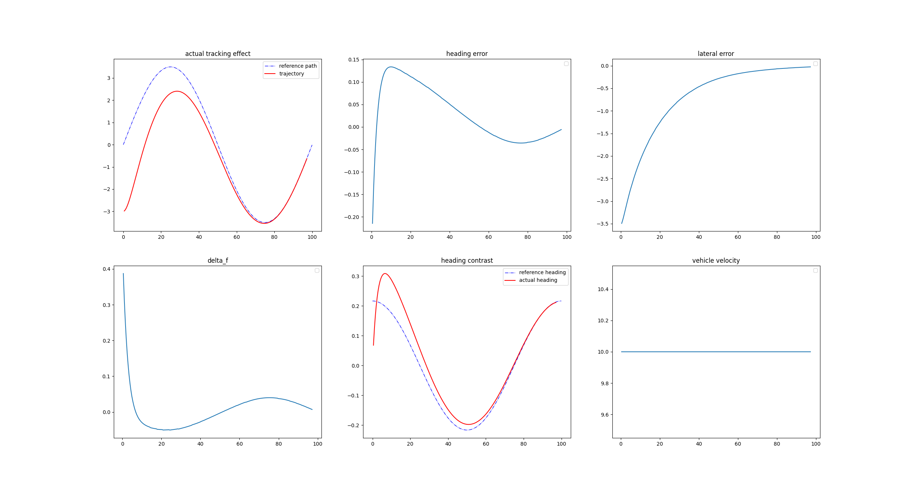
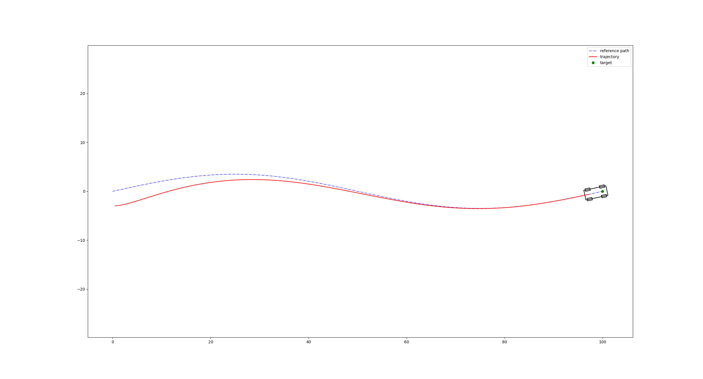

# car_model

#### How To Make
```
cd your\work\space
git clone https://github.com/lyt524/car_model.git
cd car_model/extern/
git clone https://github.com/pybind/pybind11.git
cd ../build
rm -rf *
cmake ..
make
```

#### Todo

* Add a two-degree-of-freedom (DOF) dynamics model and test it.
* Revisit the Runge-Kutta 4th order (RK4) method for the kinematic model as there seems to be an issue.
* Construct the trailer model.
* Add functions for angle-radian conversions in the mathtools (this is simple).
* Refactor the main Python function as it is currently messy.
* Implement the three-point method to compute curvature and add linear interpolation at the separation points (currently not functional).

#### Simulation Results（Stanley）




